# Daily Reflection Tree — Visual Diagram

```mermaid
flowchart TD
    START([🌙 START\nWarm opening])
    --> A1_OPEN[/A1_OPEN\nToday as a car ride?\nA driving · B backseat\nC no wheel · D found lane/]
    --> A1_D1{A1_D1\nRoute by answer}

    A1_D1 -->|A or D| A1_Q_AGENCY_HIGH[/A1_Q_AGENCY_HIGH\nWhen plan broke, first move?\nA controlled · B adjusted\nC asked · D pushed/]
    A1_D1 -->|B or C| A1_Q_AGENCY_LOW[/A1_Q_AGENCY_LOW\nWhat was in your hands?\nA tone · B priorities\nC communication · D nothing/]

    A1_Q_AGENCY_HIGH -->|signal: axis1:internal| A1_Q_GROWTH[/A1_Q_GROWTH\nSurprised yourself today?\nA noticed · B hindsight\nC held steady · D afloat/]
    A1_Q_GROWTH --> A1_D2

    A1_Q_AGENCY_LOW --> A1_D2{A1_D2\nRoute by dominant signal}

    A1_D2 -->|internal dominant| A1_R_INT[💬 A1_R_INT\nYou were at the wheel.\nAgency reflection.]
    A1_D2 -->|external dominant| A1_R_EXT[💬 A1_R_EXT\nSome days current is stronger.\nFind the small choice.]
    A1_D2 -->|external + found agency| A1_R_EXT_NUANCED[💬 A1_R_EXT_NUANCED\nYou sold yourself short —\nagency in constraints.]

    A1_R_INT --> BRIDGE_1_2
    A1_R_EXT --> BRIDGE_1_2
    A1_R_EXT_NUANCED --> BRIDGE_1_2

    BRIDGE_1_2([🌉 BRIDGE 1→2\nFrom navigating → to giving])
    --> A2_OPEN[/A2_OPEN\nEnergy in group moment?\nA helping them · B wanting notice\nC fair exchange · D what I get/]
    --> A2_D1{A2_D1\nRoute by answer}

    A2_D1 -->|A| A2_Q_CONTRIB_DEEP[/A2_Q_CONTRIB_DEEP\nFull cup or empty?\nA full · B half · C empty · D untracked/]
    A2_D1 -->|C| A2_Q_RECIPROCAL[/A2_Q_RECIPROCAL\nWent beyond expected?\nA yes unprompted · B fully present\nC stayed in lane · D pulled back/]
    A2_D1 -->|B or D| A2_Q_ENTITLEMENT[/A2_Q_ENTITLEMENT\nWhat drove that need?\nA recognition · B fairness\nC resources · D direction/]

    A2_Q_CONTRIB_DEEP -->|signal: axis2:contribution| A2_D2
    A2_Q_RECIPROCAL -->|signal: axis2:contribution| A2_D2
    A2_Q_ENTITLEMENT -->|signal: axis2:entitlement| A2_D2

    A2_D2{A2_D2\nRoute by dominant signal}
    A2_D2 -->|contribution dominant| A2_R_CONTRIB[💬 A2_R_CONTRIB\nYour energy was outward.\nOCB insight.]
    A2_D2 -->|entitlement dominant| A2_R_ENTITLEMENT[💬 A2_R_ENTITLEMENT\nWhat the work owes vs\nwhat you need to do good work.]

    A2_R_CONTRIB --> BRIDGE_2_3
    A2_R_ENTITLEMENT --> BRIDGE_2_3

    BRIDGE_2_3([🌉 BRIDGE 2→3\nFrom giving → to how wide your view was])
    --> A3_OPEN[/A3_OPEN\nBiggest challenge — who was in the frame?\nA just me · B my team\nC specific colleague · D client-end user/]
    --> A3_D1{A3_D1\nRoute by answer}

    A3_D1 -->|A| A3_Q_SELF[/A3_Q_SELF\nMoment someone else entered awareness?\nA noticed-couldn't engage · B small act\nC heads down · D not my place/]
    A3_D1 -->|B| A3_Q_TEAM[/A3_Q_TEAM\nFocus within shared experience?\nA lighten someone's load · B reflect on me\nC visible contribution · D understand others/]
    A3_D1 -->|C or D| A3_Q_WIDE[/A3_Q_WIDE\nWhat did that awareness make you do?\nA reached out · B shaped quality\nC held as context · D wasn't sure how/]

    A3_Q_SELF -->|signal: axis3:self| A3_D2
    A3_Q_TEAM -->|signal: axis3:team| A3_D2
    A3_Q_WIDE -->|signal: axis3:other| A3_D2

    A3_D2{A3_D2\nRoute by dominant signal}
    A3_D2 -->|self dominant| A3_R_SELF[💬 A3_R_SELF\nClose lens today. Try wider\none moment tomorrow.]
    A3_D2 -->|team dominant| A3_R_TEAM[💬 A3_R_TEAM\nTeam as backdrop vs\nreal distinct people.]
    A3_D2 -->|other dominant| A3_R_WIDE[💬 A3_R_WIDE\nYou were seeing past yourself.\nPerspective-taking active.]

    A3_R_SELF --> A3_SUMMARY_Q
    A3_R_TEAM --> A3_SUMMARY_Q
    A3_R_WIDE --> A3_SUMMARY_Q

    A3_SUMMARY_Q[/A3_SUMMARY_Q\nOne intention for tomorrow?\nA notice a choice · B one unsolicited act\nC check on someone first · D connect to why/]
    --> SUMMARY[📋 SUMMARY\nSynthesis: axis1 + axis2 + axis3\n+ intention interpolated]
    --> END([✅ END\nRest well.])

    style START fill:#2d3748,color:#fff,stroke:#4a5568
    style END fill:#2d3748,color:#fff,stroke:#4a5568
    style BRIDGE_1_2 fill:#744210,color:#fff,stroke:#975a16
    style BRIDGE_2_3 fill:#744210,color:#fff,stroke:#975a16
    style SUMMARY fill:#1a365d,color:#fff,stroke:#2a4a7f

    style A1_R_INT fill:#276749,color:#fff,stroke:#2f855a
    style A1_R_EXT fill:#702459,color:#fff,stroke:#97266d
    style A1_R_EXT_NUANCED fill:#702459,color:#fff,stroke:#97266d
    style A2_R_CONTRIB fill:#276749,color:#fff,stroke:#2f855a
    style A2_R_ENTITLEMENT fill:#702459,color:#fff,stroke:#97266d
    style A3_R_SELF fill:#702459,color:#fff,stroke:#97266d
    style A3_R_TEAM fill:#744210,color:#fff,stroke:#975a16
    style A3_R_WIDE fill:#276749,color:#fff,stroke:#2f855a

    style A1_D1 fill:#4a5568,color:#fff,stroke:#718096
    style A1_D2 fill:#4a5568,color:#fff,stroke:#718096
    style A2_D1 fill:#4a5568,color:#fff,stroke:#718096
    style A2_D2 fill:#4a5568,color:#fff,stroke:#718096
    style A3_D1 fill:#4a5568,color:#fff,stroke:#718096
    style A3_D2 fill:#4a5568,color:#fff,stroke:#718096
```



## Legend

| Shape | Meaning |
|---|---|
| Rounded rectangle (START/END/BRIDGE) | Auto-advance node — no user input |
| `/Parallelogram/` | Question node — employee picks an option |
| `{Diamond}` | Decision node — invisible routing based on answers or signals |
| `💬 Rectangle` | Reflection node — employee reads, clicks Continue |
| `📋 Rectangle` | Summary node — synthesises the full session |

## Signal Accumulation

```
axis1:internal  ← added by: A1_Q_AGENCY_HIGH, A1_Q_GROWTH
axis1:external  ← added by: A1_Q_AGENCY_LOW

axis2:contribution ← added by: A2_Q_CONTRIB_DEEP, A2_Q_RECIPROCAL
axis2:entitlement  ← added by: A2_Q_ENTITLEMENT

axis3:self  ← added by: A3_Q_SELF
axis3:team  ← added by: A3_Q_TEAM
axis3:other ← added by: A3_Q_WIDE
```

## Node Count Summary

| Type | Count |
|---|---|
| start | 1 |
| question | 11 |
| decision | 6 |
| reflection | 7 |
| bridge | 2 |
| summary | 1 |
| end | 1 |
| **Total** | **29** |
